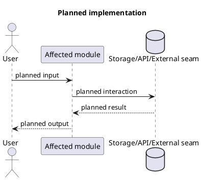

# LocalTrace 开发流程

状态：开发执行规则。

本文档定义 LocalTrace 的日常开发流程：

```text
issue -> branch -> context check when needed -> code + tests
-> PR -> review -> merge
```

目标是让每次改动都有明确范围、独立分支、本地验证、可审阅 PR 和清楚的合并记录。

## 权威顺序

开发时按这个顺序判断：

1. 仓库文档定义产品、架构和流程决策。
2. GitHub issue 定义已经批准的实现范围。
3. Branch 承载某一个 issue 的实现。
4. Pull request 汇总 diff、测试证据、review 和 merge 决策。
5. Codex 工具提供上下文、拆解、实现和检查证据。

Codex 工具辅助开发。GitHub issue 和 PR review 决定一项实现工作是否可以开始、是否可以完成。

## 工具政策

工具辅助流程，但不定义权威。

### 权威来源

开发权威顺序：

- GitHub issue 定义批准的 scope。
- Pull request 定义可 review 的 change set。
- Human review 定义 approval。

工具输出不能扩大 scope、批准工作、关闭 issue 或 merge PR。

### Task Manager

Task Manager 是可选工具，不是每个 issue 的必需步骤。

只有在这些情况使用：

- 多个 agent 并行。
- 多条工作线并行。
- 阶段顺序不清楚。
- 单个 issue checklist 已经难以维护。
- 需要状态板辅助跟踪。

Task Manager 不能：

- 替代 GitHub issue。
- 自动创建 GitHub child issues。
- 扩大 approved issue 的 scope。
- 关闭 GitHub issue。
- 替代 human review。

如果使用 Task Manager，它只能镜像 GitHub issue 的状态。GitHub issue
仍然是正式 scope 来源。

### Context Check / CodeGraph

以下情况实现前必须做 context check：

- 接触不熟悉代码。
- 从旧代码迁移行为。
- 跨模块、跨运行时、跨 UI/API 边界改动。
- 可能影响 public interface。
- 可能影响 storage schema。
- 可能影响 runtime behavior。
- 可能影响 privacy 或 security。

Context check 可以使用：

- CodeGraph。
- 仓库搜索。
- 文档。
- 手动读代码。

如果 context check 改变了 scope、风险判断或实现方向，必须把结论写回
issue 或 PR。

Context check 的典型产出：

- 相关文件和模块。
- 调用路径或依赖关系。
- 受影响的运行时入口、API、UI、配置或数据结构。
- 风险和非迁移项。

### Codex Agent

Codex Agent 用来实现代码、运行本地验证、准备 PR、处理 review 修改。

给 Codex 开始实现前，需要提供：

- GitHub issue 编号。
- 分支名，或让 Codex 按规则创建分支。
- 关联文档或 spec 章节。
- Acceptance checklist。
- 预期验证命令。

Codex 完成后需要给出：

- 改动文件列表。
- 关键实现说明。
- 验证命令和结果。
- PR summary。
- Review 修改说明。

### PR Review Agent

PR Review Agent 在 PR 创建后使用，且 PR 必须已有可 review 的 diff。

产出内容：

- 带文件和行号的 findings。
- scope、测试、回归和维护性风险。
- 需要人工 reviewer 判断的问题。

PR Review Agent 可以：

- 提 findings。
- 提风险。
- 提问题。
- 辅助 reviewer。

PR Review Agent 不能：

- approve PR。
- merge PR。
- close issue。
- 替代 human review。
- 修改 scope。

如果自动 Review Agent 未部署，可以使用手动 agent review。Human review
始终是最终门禁。

## 标准流程

### 1. Issue

每个实现改动先从 GitHub issue 开始。

Issue 需要写清楚：

- 问题是什么。
- 对用户或开发者的影响是什么。
- 本次 scope 是什么。
- 本次 issue 的边界是什么。
- Acceptance checklist。
- Verification plan。
- Implementation plan，适用于 non-trivial implementation issue。
- 相关 docs、spec、设计或历史决策链接。
- Context check notes，适用于需要影响分析的改动。
- Task Manager link 或 task ID，适用于被 Task Manager 跟踪的 issue。

一个阶段可以只有一个 active issue。不要自动拆 GitHub child issues。

只有当 checklist 混入多个无关组件、无关风险或无关测试路径，并且人类
明确要求拆分时，才拆成多个 issue。

Issue 模板：

````markdown
# Short Title

## Problem

## Impact

## Scope

## Boundaries

This issue only covers:

- ...

Future or separate issues cover:

- ...

## Acceptance Checklist

- [ ] ...

## Verification

Expected commands:

```bash
...
```

## Implementation Plan

Required for non-trivial implementation issues before coding starts.



- Expected changed files:
- Acceptance mapping:
- Explicit non-goals:
- Verification flow:

## References

- Spec:
- Context check notes:
- Task Manager:

## Review Gate

Implementation starts after human approval.
````

进入下一步前确认：

- Issue 有明确 acceptance checklist。
- Issue 有 verification plan。
- Non-trivial implementation issue 已经在 issue 中保存 PlantUML implementation plan。
- 人工已经批准开始实现。

### 2. Branch

Issue 批准后创建 branch。

分支命名：

```text
<type>/<issue-number>-<short-title>
```

示例：

```text
docs/123-development-workflow
fix/124-update-retry-startup
feat/125-report-export-settings
chore/126-localtrace-ci
```

Branch 需要做到：

- 从当前 main 分支切出。
- 一个 branch 绑定一个 issue。
- commit message 在合适时引用 issue。
- 不使用长期聚合分支连续承载多个阶段。
- 当前 issue merge 后，下一项工作从 main 新切 branch。

Commit 示例：

```text
docs(workflow): add development workflow guide
fix(update): wait for updater process startup
feat(reports): add export settings panel
```

### 3. Code

编辑前需要做：

1. 读 issue 和关联文档。
2. 如果触发 context check 条件，先完成影响分析。
3. 对 non-trivial implementation issue，在 issue 中写入 PlantUML implementation plan。
4. 找到满足 acceptance checklist 的最小文件集合。
5. 如果该 issue 在 Task Manager 里跟踪，把状态改到 `In Progress`。

PlantUML implementation plan 用来记录 agent 的实现意图，方便 review 时对比
planned flow 和 actual diff。它需要覆盖：

- 受影响模块或文件。
- runtime、API、data、storage 或外部 seam 的预期流向。
- 测试或验证流向。
- 预期改动文件。
- acceptance checklist 对应关系。
- 明确排除的 non-goals。

PlantUML plan 只对 non-trivial implementation issue 强制要求。Tiny fixes
可以使用文本计划替代，例如 typo、文案、单行配置修正、PR/issue 元数据更新，
或当前 scope 内的机械 lint 修复。

Plan 可以在编码前更新。编码开始后，如果实际实现路线发生实质偏离，必须把
deviation notes 写入 issue 或 PR，并确认偏离仍在 issue scope 内。

编辑过程中需要做：

- 按批准的 issue scope 实现。
- 把无关格式化、无关重命名、无关依赖变化和无关生成文件留到单独 issue。
- 行为、命令或流程变化时同步文档。
- 按风险级别补测试或验证。
- 发现新增工作时，先更新 issue 或创建 follow-up issue，再实现新增范围。
- 如果实际实现偏离 issue 中的 PlantUML plan，记录偏移原因和 scope 判断。

Code 完成标准：

- Acceptance checklist 已实现。
- 改动文件符合 issue scope。
- 文档反映新的行为或流程。
- 测试或验证覆盖了改动行为。

## 小步开发规则

默认节奏：

```text
one approved issue -> one branch -> focused commits
-> one PR -> review -> merge -> next issue
```

硬规则：

- 一个 PR 只解决一个清晰目标。
- 一个 branch 默认只绑定一个 issue。
- 不把后续阶段连续堆到同一个长期分支。
- 不把无关 docs、CI、infra、runtime 行为混进同一个 PR。
- 合并当前 PR 后，再从 main 切下一个 issue 的 branch。
- Review Agent 只在 PR 创建后运行；它不能作为开发前置批准。
- Task Manager 只在协调复杂度需要时使用；普通小 issue 不用。
- CodeGraph 或 context check 在动陌生代码、API、schema、runtime、privacy
  或 security 前使用。
- 需要 Python 环境时，在仓库本地创建，例如 `localtrace/.venv`。
- 本地 Python 环境不提交到 git。
- Codex 写的 commit 使用 `Codex Agent` git author，不使用人类开发者姓名。
- GitHub PR author 由创建 PR 的 GitHub 登录态决定，不由 commit author 决定。
- 如果 Codex 使用人类 GitHub 登录态创建 PR，该人类会成为 PR author。
- PR author 不能 approve 自己的 PR。
- 如果仓库有独立 reviewer，人工 approval 必须来自非 PR author 的 reviewer。
- 如果 solo repo 没有独立 reviewer，PR author 不能点 GitHub Approve；owner
  亲自执行 merge 视为人工 review 和 merge authorization 记录。

PR 尺寸目标：

- 文档 PR 目标少于 300 行 diff。
- 普通代码 PR 目标少于 500 行 diff。
- 超过目标时，先判断是否拆 scope，而不是继续堆代码。

允许一个 phase 使用一个 issue 的前提：

- checklist 仍然可 review。
- diff 仍然集中在一个目标上。
- 每次 PR 仍然可以独立合并。

如果 phase issue 变大：

- 不自动创建大量 child issues。
- 先让人类决定是否拆成更小 issue。
- 拆分后每个 issue 都单独走 branch、PR、review、merge。

### 4. Tests

开 PR 前运行相关本地检查。

按改动区域选择命令：

- LocalTrace Python/runtime:
  `localtrace/.venv/bin/python -m pytest localtrace/tests -q`
  `localtrace/.venv/bin/python -m ruff check localtrace`
  `localtrace/.venv/bin/python -m ruff format --check localtrace`
- LocalTrace Web UI:
  `node --check localtrace/web/app.js`
- LocalTrace browser extension:
  `node --test localtrace/extension/*.test.mjs`
  Chrome/Edge 手动加载、extension console 检查、`/health` 或 event smoke test
- LocalTrace docs:
  `npm --prefix localtrace run lint:md`
  `mkdocs build --strict -f localtrace/mkdocs.yml`
- Repo hooks:
  `pre-commit run --all-files`
- LocalTrace Windows packaging:
  `powershell -NoProfile -ExecutionPolicy Bypass -File .\localtrace\packaging\build-windows.ps1`

Verification notes 需要记录：

- 精确命令。
- 通过或失败结果。
- 关键输出摘要。
- 跳过的命令、原因和替代验证方式。

进入下一步前确认：

- 必要本地检查已通过。
- 已知验证缺口写进 PR。
- UI 改动有截图或明确的视觉验证说明。

### 5. PR

本地验证后打开 PR。

PR 需要包含：

- 关联一个 issue；范围更大时需要人工提前批准。
- 使用 `Fixes #<issue-number>` 或 `Closes #<issue-number>` 关闭对应 issue。
- 改动摘要。
- Planned implementation 和 actual diff 的对比。
- 验证命令和结果。
- UI 改动截图。
- 生成文件变化说明。
- 跨模块改动的 context check 影响说明。
- Task Manager 状态同步到 `Review`，适用于被跟踪的 issue。

PR 模板：

```markdown
## Summary

- ...

## Issue

Fixes #...

## Scope Check

- Issue scope:
- Changed areas:
- CodeGraph impact notes:

## Plan vs Actual

- Planned changed files:
- Actual changed files:
- Planned flow vs actual flow:
- Deviations:
- Acceptance mapping:

## Verification

- [ ] `command` - result

## UI Evidence

Screenshots or visual notes:

## Risk Notes

- ...
```

进入 review 前确认：

- PR 描述说明改了什么、怎么验证。
- PR 对比了 issue plan 和 actual diff。
- 如果实际流程实质偏离计划，PR 已补充 actual implementation PlantUML 或 deviation notes。
- CI 已启动或已完成。
- Reviewer 能从 diff 对回 issue acceptance checklist。

### 6. Review

Review 用来确认 scope、行为、测试和可维护性。

Review 顺序：

1. CI 运行。
2. PR Review Agent 运行，适用于已配置的仓库。
3. 人工 reviewer 检查 diff、行为和验证证据。
4. Codex Agent 在同一分支处理 review comments。
5. Review 修改后重新运行相关测试。
6. PR 描述补齐最终验证结果。

Review checklist：

- Diff 符合 issue scope。
- Diff 与 issue implementation plan 一致，或偏移已经解释且仍在 scope 内。
- Acceptance checklist 已完成。
- 测试覆盖改动行为。
- CI 通过。
- Review comments 已解决。
- 非 PR author 的人工 approval 已记录；solo repo 中 owner merge 操作可以作为
  人工 review 记录。

### 7. Merge

Approval 和检查通过后 merge。

Merge 前确认：

- PR 已获得非 PR author 的人工 approval；solo repo 中 owner 准备亲自 merge
  时可用 merge 操作本身作为 review 记录。
- CI 通过，或 PR 写明已接受的例外。
- PR 带 issue closure keyword。
- 用户可见变化已经更新 release notes。
- Task Manager 在 merge 后同步到 `Done`，适用于被跟踪的 issue。
- 合并后删除不再需要的 branch。

Merge 后需要做：

- 确认 issue 已关闭，或已写明剩余 follow-up。
- 对 review 中发现的延期工作创建 follow-up issue。
- 持久架构或流程决策写回仓库文档。
- follow-up 影响面不清楚时继续做 context check。

## 小改动快路径

小修也走同一条链路，只缩短材料：

```text
short issue -> small branch -> focused diff -> relevant test
-> PR -> review -> merge
```

短 issue 仍然需要：

- Problem。
- Scope。
- Acceptance。
- Verification。
- Text-only implementation plan，除非它实际属于 non-trivial implementation。

## 文档改动

文档改动在这些情况也需要 issue 和 PR：

- 改开发流程。
- 改架构决策。
- 改产品行为。
- 改发布流程。
- 改贡献者指导。

最小验证：

- 格式重要时检查 Markdown 渲染结果。
- 路径被 lint config 覆盖时运行 Markdown lint。
- 检查本地文件链接。

## 工具使用时机表

| 阶段 | CodeGraph | Task Manager | Codex Agent | GitHub |
| --- | --- | --- | --- | --- |
| Intake | 条件触发时看代码图 | 可选记录候选任务 | 总结需求 | 起草 issue |
| Issue | 补影响说明 | 可选关联任务 | 起草 scope 和 acceptance | 批准 issue |
| Branch | 条件触发时确认模块 | 可选标记状态 | 创建 branch | 从 base 切分支 |
| Code | 查依赖和调用路径 | 可选跟踪子任务 | 编辑文件 | commit 到 branch |
| Tests | 确认受影响 surface | 可选跟踪验证 | 运行命令并修复失败 | 准备 PR 证据 |
| PR | 总结影响面 | 可选标记 review | 写 PR 描述 | 打开 PR |
| Review | 回答影响面问题 | 可选跟踪 fixes | 处理 review 修改 | 人工 review 和 CI |
| Merge | 支持 follow-up 分析 | 可选标记 done | 总结最终状态 | merge 并关闭 issue |

## Codex Prompt 模板

分配实现任务给 Codex 时使用：

```text
Work on GitHub issue #<number>.
Create or use branch <type>/<issue-number>-<short-title>.
Read the linked docs and acceptance checklist first.
Run context check before editing when the work touches unfamiliar code,
migrates old behavior, crosses module boundaries, or may affect public
interfaces, storage, runtime behavior, privacy, or security.
For non-trivial implementation issues, post a PlantUML implementation plan in
the issue before coding starts. Keep the plan small and map it to acceptance
criteria and expected changed files.
Implement only this issue scope.
Run the relevant verification commands.
Prepare a PR summary with changed files, plan-vs-actual notes, tests, risks,
and Fixes #<number>.
Update Task Manager state only if this issue is tracked there.
```

## Definition Of Done

一项改动完成时必须满足：

- Linked issue scope 已实现。
- Non-trivial implementation issue 有 pre-code PlantUML plan。
- PR 已记录 planned implementation 与 actual diff 的对比。
- Acceptance checklist 已完成。
- Local verification 已运行。
- CI 已通过，或 PR 记录了已接受的例外。
- PR review 已完成。
- 人工 approval 已记录。
- PR 已 merge。
- Issue 已关闭，或已写明剩余 follow-up。
