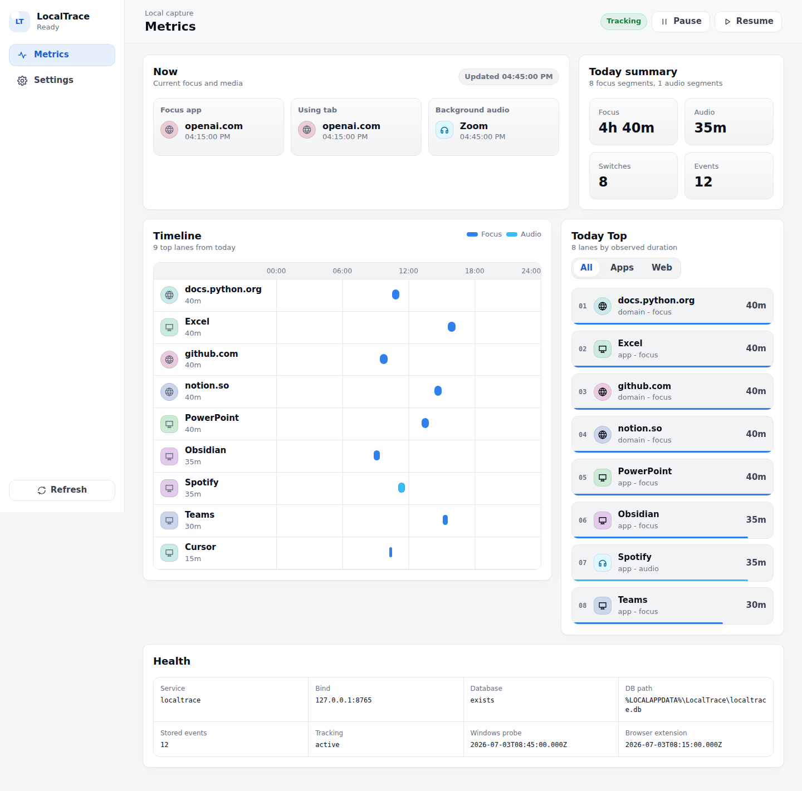

# LocalTrace

LocalTrace 是给 Windows agent 使用的本地活动上下文工具。它记录前台应用、浏览器标签页活动和非浏览器音频，把原始事件保存在本机，并提供一个本地 Web UI 查看当天活动。

## 先让 Agent 安装 Skill

如果要让 agent 使用 LocalTrace，先让它安装 LocalTrace Skill。整个安装过程由 agent 完成，你不需要手动运行安装命令。

可以直接对 agent 说：

> 请从 GitHub 仓库 [CHZarles/LocalTrace](https://github.com/CHZarles/LocalTrace) 安装 LocalTrace Skill。只使用仓库 skill 目录里的安装器完成安装，不要让我手动运行命令。安装完成后，检查 skill 是否可用，并打开 LocalTrace Web UI。

安装入口只有一个：仓库 skill 目录里的安装器。agent 会自行执行安装器，把 skill 放到本地 skill 目录，并创建后续调用入口。

安装完成后，agent 可以通过这个 skill 打开 Web UI、检查 LocalTrace 状态、读取最近活动、汇总一天活动，或解释一段时间里的活动空白。用户不需要读取数据库，也不需要导出事件文件。

## 手动加载浏览器插件

浏览器插件目前需要用户手动加载。LocalTrace 会准备插件包，但 Chrome / Edge 不允许普通本地程序静默安装未上架插件。

你需要做的只有这一步：把发布包里的 `extension/localtrace-extension.zip` 解压出来，然后在浏览器里加载这个已解压的插件目录。

Chrome：

1. 打开 Chrome 扩展管理页：`chrome://extensions/`。
2. 打开右上角的「开发者模式」。
3. 点击「加载已解压的扩展程序」。
4. 选择刚才解压出来的插件目录，也就是包含 `manifest.json` 的目录。
5. 打开 LocalTrace 插件弹窗，确认 health 显示 OK。

Edge：

1. 打开 Edge 扩展管理页：`edge://extensions/`。
2. 打开「开发人员模式」。
3. 点击「加载解压缩的扩展」。
4. 选择刚才解压出来的插件目录，也就是包含 `manifest.json` 的目录。
5. 打开 LocalTrace 插件弹窗，确认 health 显示 OK。

如果 health 不是 OK，先确认 LocalTrace Web UI 可以正常打开。插件只会连接本机的 LocalTrace，不会把浏览器活动发送到云端。

## 子命令和触发方式

你不需要记住子命令。直接用自然语言告诉 agent 想查什么，agent 会自己选择合适的子命令。

| 你可以对 agent 说 | agent 会使用 | 用途 |
| --- | --- | --- |
| 打开 LocalTrace 面板 | `dashboard` | 打开本地 Web UI。 |
| 检查 LocalTrace 是否正常 | `health` | 查看服务、采集状态、数据库和最近来源时间。 |
| 看看我刚才在做什么 | `recent-events` | 读取最近活动，并按时间、应用、网站和事件类型整理。 |
| 总结今天的活动 | `day-summary` | 汇总某一天的事件数量、主要应用/网站、来源和时间范围。 |
| 看看我这几天切换注意力的情况 | `focus-switches` | 返回切换次数、目标时长、未知/空闲时长、切换列表和 `prompt_context`。 |
| 查某一段时间发生了什么 | `events-between` | 读取指定时间窗口内的原始活动事件。 |
| 解释这段时间为什么没有记录 | `explain-gap` | 查找空白区间内、前后最近的活动上下文。 |

`focus-switches` 只返回事实数据，不自带评分。agent 可以结合你提供的 prompt 再做评价。

## Web UI

Web UI 默认在本机 `127.0.0.1` 上打开。它分成两个页面：

- **Metrics**：当前活动、今日汇总、时间轴、Top 应用/网站、Health。
- **Settings**：采集设置和隐私规则。

## 它记录什么

LocalTrace 只记录用于回看活动轨迹的本地信号：

- Windows 前台应用焦点。
- 非浏览器后台音频。
- Chrome / Edge 标签页焦点和标签页音频。
- 保存在本机的原始事件。

它不做日报生成、任务规划、review 工作流或云同步。Web UI 里的视图都从本机原始事件即时计算。

## 隐私边界

LocalTrace 不记录网页正文，不截图，不记录键盘输入，不上传到云端，也不提供局域网访问服务。

如果需要进一步收紧记录范围，可以在 Web UI 的 Settings 页面调整采集选项，或添加隐私规则，对指定应用或域名进行隐藏或丢弃。

## Windows 运行时

LocalTrace Skill 负责让 agent 查询活动记录；Windows 运行时负责真正采集和保存事件。

发布包是 `LocalTrace-windows.zip`。解压后，使用包内安装器安装 Windows 运行时。

## 开发者文档

根目录 README 只保留用户和 agent 安装入口。开发、打包、架构和测试资料仍保留在这些文档中：

- [DEVELOPING.md](DEVELOPING.md)
- [WINDOWS_DEV.md](WINDOWS_DEV.md)
- [RELEASING.md](RELEASING.md)
- [docs/](docs)
- [web/README.md](web/README.md)
- [extension/README.md](extension/README.md)
- [skill/README.md](skill/README.md)
