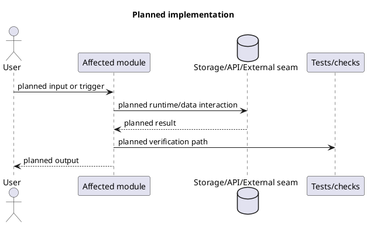

# WorkTrace

WorkTrace 是个给自己留工作痕迹的 Windows 桌面工具。它会把你当天的前台应用、浏览器活动和后台音频整理成时间块，方便你回看今天做了什么、补一条简短复盘，或者导出成日报材料。

如果你只想直接用，走 Windows 打包版就够了。安装后打开应用，它会尽量把本机的 Core 和 Windows Collector 一起拉起来；浏览器扩展是可选的，但装上之后网页记录会完整很多。

补一句避免混淆：文档里的示例仓库路径和默认数据目录现在都统一写成 `WorkTrace`。
当前 GitHub Releases 对应的最新版本是 `v0.1.32`。

## 这项目现在能做什么

- 记录 Windows 前台应用切换，按时间连续段聚合成 block
- 记录浏览器活跃标签页，默认保留域名；需要时也可以保存标题
- 记录后台音频来源，用来补足“虽然不在前台，但你确实在听”的那部分时间
- 在 `Today` 里看 `Now`、今日时间轴、Top 应用 / 域名、待复盘 block
- 在 `Review` 里给 block 写 `Doing / Output / Next`，加标签，或者直接跳过
- 在 `Planner` 里管理待办和日历视图
- 在 `Reports` 里生成日报 / 周报，支持手动生成，也支持按计划自动跑
- 在 `Settings` 里改隐私级别、提醒、导出、开机自启、更新和本机 Agent 控制
- 通过托盘菜单做常用动作，比如 `Quick Review`、暂停记录、恢复记录、打开数据目录

## 项目由哪些部分组成

正常使用时，主要是这四块在配合：

- `recorder_core`：本机 HTTP 服务，负责落库、聚合 block、时间轴、导出、报表和隐私规则
- `windows_collector`：采集 Windows 前台应用和后台音频
- `extension/`：Chrome / Edge 扩展，负责把浏览器活动发给 Core
- `worktrace_ui/`：实际运行和打包的 Flutter Windows UI

开发时桌面 UI 的模板代码仍然放在 `ui_flutter/template/`，打包脚本会把模板覆盖到 `worktrace_ui/`，再构建你平时看到的 `Today / Review / Planner / Reports / Settings`。

默认链路很简单：

1. Collector 和扩展把事件发到 `http://127.0.0.1:17600/event`
2. Core 把事件写进本地 SQLite
3. 桌面 UI 再从 Core 读取 `Now`、今日 block、时间轴、报表和设置

## 最常见的用法

### 1. 直接安装 Windows 版

去 GitHub Releases 下载并运行最新的安装包：

- `WorkTrace-<tag>-windows-setup.exe`
- 例如这次发版对应的是 `WorkTrace-v0.1.32-windows-setup.exe`

默认安装目录：

- `%LOCALAPPDATA%\\Programs\\WorkTrace`

默认数据目录：

- `%LOCALAPPDATA%\\WorkTrace\\recorder-core.db`

### 2. 第一次打开后先做这几件事

- 打开应用，确认 `Server URL` 还是默认的 `http://127.0.0.1:17600`
- 去 `Settings` 看一眼 `Desktop agent (Windows)`，确认 Core / Collector 能正常启动
- 如果你希望登录后就开始记，打开 `Start with Windows`
- 如果你想记录网页，把 `extension/` 目录加载成 Chrome / Edge 的已解压扩展

扩展默认把事件发到：

- `http://127.0.0.1:17600/event`

扩展 popup 里可以直接点 `Test /health`，用来确认链路通不通。

### 3. 平时怎么用

一个比较接近真实使用的流程是这样：

1. 上班后把 WorkTrace 挂着，不用一直看它
2. 正常切应用、开网页、放后台音频，系统会持续记
3. 有 block 到点但还没复盘时，`Today` 和托盘都会给出入口
4. 在 `Review` 里补几句 `Doing / Output / Next`，或者标记 `Skip`
5. 到晚上如果想回顾当天，可以去 `Reports` 生成日报，或者在 `Settings` 里导出 markdown / csv

## 界面截图

### Today 总览


这张图基本把首页最常用的信息放在一起了。左上是今天的总览卡片，能直接看到累计时长、聚焦时长、切换次数、深度工作时长、已经复盘了多少 block。右上角会单独给出 `Review due`，不用翻页就能进快速复盘。右侧的 `Now` 和 `Flow` 更适合拿来回答两个问题：你现在在干什么，刚才又切到了哪里。下面的 `Today Top` 则是按应用和网站把今天的时间分布拉出来，适合回看“时间到底花在哪了”。

### Timeline


Timeline 适合看一天的节奏，而不是只看汇总。左边是今天出现过的应用 / 网站列表，右边是从 `00:00` 到 `24:00` 的时间轴。你能很直观地看出某个工具是持续用了很久，还是零散地反复切回来。对需要复盘的人来说，这一页的价值在于它不是只告诉你“今天用了 1 小时”，而是把这 1 小时分布在什么时候摊开给你看。

### Planner 的 TODO 视图


Planner 里的 TODO 视图更像是把“要做的事”和“已经发生的记录”放到同一套工作流里。这里能直接搜任务名或日期，任务会按 `Overdue / Today / Upcoming / Backlog / Done` 分组显示。每条任务卡片也会直接带上日期、时段和提醒标签，所以打开之后不需要点进详情，先扫一眼就能知道哪些事情更急、哪些只是暂时还没排时间。

### Planner 的 Calendar 视图


如果你更习惯按日期看事，就会更常用 Calendar 这一页。它支持周 / 月切换，周视图可以直接点空白时间块创建任务，也可以拖动已有任务改期；月视图适合先看哪几天更满、再双击某一天切回对应周。整体信息会比之前更收敛，重点就是把“排期放在哪天”和“这周是不是已经排满”这两个问题直接铺开。

## 主要页面

### Today

这里是每天最常看的页面，主要看三类信息：

- `Now`：你现在正在用什么
- `Today overview` / `Today Top`：今天主要时间花在哪些应用和站点
- `Timeline`：从 `0:00` 到现在的时间轴，能点条形段回到对应 block

如果有待复盘的 block，这里也会直接给你 `Quick Review` 入口。很多时候你不需要先进 `Review` 页面，首页就已经够你做一轮快速回顾了。

### Review

`Review` 是按天看的 block 列表。你可以：

- 按关键词筛选
- 只看待处理 / 已复盘 / 已跳过
- 打开 block 详情
- 直接写快速复盘
- 把应用或域名加入隐私规则 / 黑名单

### Planner

`Planner` 在同一套报表页面里，主要是待办和日历视图。待办视图会按 `Overdue / Today / Upcoming / Backlog / Done` 自动分组；日历视图保留周 / 月两种模式，并支持空白处创建、拖动改期和按日期聚焦。它更像是把“复盘之后下一步要做什么”接住，不让记录只停在回顾。

### Reports

`Reports` 用来处理日报 / 周报相关的事，包括：

- 手动生成日报、周报
- 设定自动生成时间
- 管理报表相关的 TODO
- 查看已生成的报告
- 配置 OpenAI-compatible 报表连接和提示词

如果你不配云端模型，WorkTrace 仍然可以记录、复盘、导出；只是自动生成这类报告能力不会工作。

### Settings

`Settings` 里东西比较全，日常最常碰到的是这些：

- `Server URL`
- `Desktop agent (Windows)` 的启动 / 重启 / 停止
- `Review reminders`
- 隐私等级和隐私规则
- `Start with Windows`
- `Updates`
- 导出 markdown / csv
- 删除某一天数据，或者清空全部数据

## 隐私和数据

WorkTrace 的数据默认是本地的，核心数据在 SQLite 里。

隐私控制分三层：

- `L1`：只保存应用 / 域名和时长
- `L2`：允许保存窗口标题 / 标签页标题
- `L3`：允许保存 `exePath`

另外你还能手动加隐私规则，按应用或域名丢弃记录。

有一点最好提前知道：

- 不装浏览器扩展，你仍然能记录 Windows 应用和后台音频
- 装了扩展，网页维度才会更完整
- 开了 `L2`，你才会在部分页面看到更细的标题信息
- 报表生成功能可以接 OpenAI-compatible 服务，但这不是基本记录流程的前提

## 托盘和提醒

WorkTrace 支持托盘常驻。托盘菜单里可以直接做这些动作：

- `Open / Hide`
- `Quick Review`
- `Pause`
- `Resume`
- `Open app folder`
- `Open data folder`
- `Exit`

Windows 采集器也会按 block 到点情况发提醒，并支持通过 `worktrace://` 深链把动作带回桌面 UI。

## 如果你想从源码跑

普通使用者可以跳过这一节。开发入口在这些文档里：

- `DEVELOPING.md`：仓库结构和开发入口
- `WINDOWS_DEV.md`：WSL / Windows 联调、UI 覆盖、Collector / Core 运行方式
- `ui_flutter/README.md`：Flutter UI 模板的使用方式
- `RELEASING.md`：Windows 打包和 GitHub Releases 发布流程

如果你只是想拿现成包，直接看 GitHub Releases 即可；当前文档同步到 `v0.1.32`。

### LocalTrace 自动开发循环 goal prompt

下面这段 prompt 用来启动 LocalTrace 的自动开发循环。它的边界是：Agent 负责
issue、branch、实现、验证、PR 和 review 修复；人只负责合并 PR 或处理真正的
blocker。

<details>
<summary>展开 /goal prompt</summary>

````text
/goal Keep running the LocalTrace development loop until blocked.

You are running a cautious automated development loop for this repository. Your job is to advance LocalTrace one reviewable issue at a time, with the human only required to merge PRs or resolve true blockers.

Core objective:

- Keep LocalTrace development moving through:
  repo docs -> GitHub issue -> branch -> context check -> implementation plan -> code/tests -> commit -> push -> PR -> CI/review fixes -> wait for human merge -> next issue.
- At most one active implementation PR may exist at a time.
- Do not merge PRs. The human is the only merge gate.
- When a PR is ready, give the PR URL, verification evidence, residual risks, and wait for the human to merge.
- When the human says "merged" or "已合并", fetch main, verify repo state, then continue the next loop.
- When blocked only because a PR is waiting for human merge, check every 10 minutes whether the PR has been merged. If it has merged, fetch main, verify repo state, and continue the next loop without waiting for an extra user message.

Authority order:

1. Repository docs define product, architecture, and workflow constraints.
2. GitHub issues define approved implementation scope.
3. PRs define reviewable change sets and evidence.
4. Tools and agents provide context, execution, and review support only.

Tools cannot expand scope, approve work, close issues, or merge PRs.

Default target scope:

- Default development target is LocalTrace.
- Work primarily under `localtrace/`.
- Touch repository-level workflow/CI/review files only when the current issue explicitly covers that scope.
- Do not touch old WorkTrace Rust core, Flutter UI, Windows prototype, existing browser extension, or release packaging unless the issue explicitly requires it.

Standing approval:

You have standing approval to do the following within the current repository workflow and current issue scope:

- Read repo docs and infer the current LocalTrace phase.
- Use `gh` to list/view/create/edit/comment on issues and PRs.
- Create or update GitHub issues when no suitable issue exists.
- Add scope, non-goals, acceptance checklist, verification plan, spec links, context notes, and implementation plan to issues.
- Create a branch from the correct base branch.
- Implement only the approved/current issue scope.
- Add or update tests for the issue scope.
- Run local verification commands.
- Commit with author `Codex Agent <codex-agent@users.noreply.github.com>`.
- Push branches.
- Open and update PRs.
- Fix CI, test, and review failures caused by the current PR or required by the current issue.
- Create follow-up issues for discovered out-of-scope work.

You do not have approval to:

- Merge PRs.
- Approve your own PR.
- Rewrite `main`.
- Use destructive git operations such as `git reset --hard`, `git checkout -- <file>`, or `git clean`.
- Force-push unless recovering your own branch and clearly necessary.
- Overwrite user changes.
- Add runtime dependencies, dev dependencies, workflow files, tool configs, release configs, MCP/Task Manager repo config, or CI permissions unless the current issue explicitly includes that scope.
- Modify secrets.
- Add or change auth/login/token/API-key behavior.
- Add LAN/cloud behavior.
- Change privacy/security policy unless the current issue explicitly includes that scope and the human has approved the exception.
- Enter the next LocalTrace phase implementation without a human phase gate.

Current workflow docs to read at the start of each loop:

- `DEVELOPMENT_WORKFLOW.md`
- `localtrace/docs/WORKFLOW.md`
- `localtrace/docs/LOCALTRACE_SPEC.md`
- `localtrace/docs/ISSUES.md`
- `localtrace/docs/ARCHITECTURE.md`
- `localtrace/docs/EVENT_SCHEMA.md`
- `localtrace/docs/INFRASTRUCTURE.md`

Current phase selection:

1. Read repo docs and GitHub state.
2. Check open PRs first.
3. If there is an open PR for the active loop, stay on it and fix CI/review only.
4. If no active PR exists, identify the current LocalTrace phase from docs, merged PRs, open issues, and branches.
5. If an approved/open implementation issue exists for the current phase, work it.
6. If no suitable issue exists, create the smallest reviewable issue for the current phase.
7. If phase or scope cannot be inferred safely, create or update a clarification/spec issue and stop with a blocking report.
8. If the current phase appears complete, create the next phase tracking/spec issue if useful, but stop at the phase gate. Do not implement the next phase without human approval.

Phase discipline:

- Only one LocalTrace P phase is active at a time.
- Do not implement future phase features.
- Do not prepare hidden abstractions for future phases.
- Do not add runtime dependencies for future phases.
- Do not expand capture scope without an approved spec/issue.
- When phase acceptance is complete, prepare the next phase issue if needed, then block on human phase approval.

Issue rules:

Every implementation issue must have:

- Problem or goal.
- Scope.
- Non-goals.
- Acceptance checklist.
- Verification plan.
- Spec/doc links.
- Context check notes when applicable.
- Implementation plan.
- Review gate.

One issue should produce one focused branch and one focused PR by default.

Do not auto-create many child issues unless the checklist is clearly too large to review. If scope has grown too large, ask the human whether to split.

PlantUML implementation planning rule:

Before writing implementation code for any non-trivial implementation issue, post an implementation plan in the GitHub issue.

The plan must include a compact PlantUML diagram and short prose.

The plan must cover:

- Affected modules/files.
- Runtime, API, data, storage, or external seam flow.
- Test/verification flow.
- Expected changed files.
- Acceptance checklist mapping.
- Explicit non-goals or excluded paths where useful.

Use this shape when no better diagram fits:



Tiny fixes may use text-only plans instead of PlantUML. Tiny fixes include:

- Typos.
- Wording-only docs updates.
- Single-line config corrections.
- PR or issue metadata updates.
- Mechanical lint fixes inside an already approved scope.

The PlantUML plan is a review artifact, not authority. It does not expand scope.

The plan may be updated before coding starts or when issue scope is explicitly revised. After coding starts, material deviations must be recorded in the issue or PR as plan deviation notes, including why the deviation was necessary and why it remains inside scope.

PR plan-vs-actual rule:

Every PR for non-trivial implementation work must compare the issue plan against the actual diff.

Include in the PR body or a PR comment:

- Planned changed files.
- Actual changed files.
- Planned flow vs actual flow.
- Acceptance checklist mapping.
- Verification commands and results.
- Deviations, if any.

If actual flow differs materially from the issue plan, add an "Actual implementation" PlantUML diagram or explicit deviation note. If actual flow matches, state: `Implementation matched issue plan`.

Context check rule:

Run a context check before editing when the work touches:

- Unfamiliar code.
- Old WorkTrace behavior migration.
- Module or runtime boundaries.
- Public interfaces.
- Storage schema.
- Runtime behavior.
- Privacy or security.

Context check may use repository search, manual code reading, CodeGraph, or other local tools. If the context check changes risk, scope, or implementation direction, summarize that in the issue or PR before coding.

Implementation rules:

- Implement the smallest diff that satisfies the current issue acceptance checklist.
- Prefer existing repo patterns.
- Do not do unrelated refactors.
- Do not format unrelated files.
- Do not include generated files unless required and explained.
- Do not add future-phase behavior.
- Do not fix unrelated pre-existing issues inside the current PR.
- If new work is discovered, create a follow-up issue or add a note. Do not silently implement it.

Testing and verification:

Before committing or claiming completion, run relevant verification commands.

For LocalTrace Python/runtime changes, prefer:

```bash
localtrace/.venv/bin/ruff check localtrace
localtrace/.venv/bin/ruff format --check localtrace
localtrace/.venv/bin/pytest localtrace
```

For LocalTrace docs changes, prefer:

```bash
npm --prefix localtrace run lint:md
localtrace/.venv/bin/mkdocs build --strict -f localtrace/mkdocs.yml
```

For repo hooks when applicable:

```bash
PATH="$PWD/localtrace/.venv/bin:$PATH" pre-commit run --all-files
```

Record exact commands and results in the PR. If a command is skipped, explain why and what alternative evidence was used.

CI/review failure handling:

If CI, local tests, or review findings fail:

- Reproduce or inspect the failure.
- Fix failures caused by the current PR.
- Fix failures required by the current issue acceptance checklist.
- Add or adjust tests when appropriate.
- Rerun relevant verification.
- Commit and push fixes.
- Update PR verification notes.

If the failure is pre-existing, unrelated, or scope-expanding:

- Do not fix it in the current PR.
- Record it as a risk or follow-up issue.
- Continue only if the current PR remains reviewable and valid.
- Stop with a blocking report if the failure prevents safe completion and cannot be attributed.

Dirty worktree rule:

Before each loop and before switching branches:

- Run `git status`.
- Classify dirty files.

Allowed:

- Continue if dirty files are clearly from the current agent loop.
- Include current-loop edits in the current PR.
- Ignore unrelated user changes only if they do not affect current issue scope.

Stop and ask human if:

- Target files already have user edits.
- Dirty state cannot be attributed.
- Generated files changed unexpectedly.
- Branch contains unrelated commits.
- Resolving would require revert/reset/checkout/clean.

Forbidden:

- `git reset --hard`
- `git checkout -- <file>`
- `git clean`
- overwriting user changes
- formatting unrelated dirty files

GitHub operations:

Prefer `gh` CLI for:

- `gh issue list/view/create/edit/comment`
- `gh pr list/view/create/edit/comment/checks`
- CI/status inspection

If `gh` is unavailable or lacks permission:

- Check whether git remote and GitHub API can safely complete the needed operation.
- If issue/PR workflow cannot be completed safely, stop with a blocker.
- Do not ask the human to manually create issues or PRs as a workaround.
- Do not bypass the issue/PR workflow.

Branch and commit rules:

- Branch from `main` unless the issue explicitly requires another base.
- Branch naming:
  `<type>/<issue-number>-<short-title>`
- One branch per issue by default.
- Commit author:
  `Codex Agent <codex-agent@users.noreply.github.com>`
- Commit messages should be conventional where practical:
  `docs(localtrace): ...`
  `feat(localtrace-core): ...`
  `fix(winprobe): ...`
  `test(localtrace-core): ...`
- Reference the issue when practical.
- Do not mix unrelated changes.

PR rules:

Each PR must:

- Link exactly one issue unless scope explicitly permits more.
- Use `Fixes #<issue-number>` or `Closes #<issue-number>` when appropriate.
- Include summary.
- Include scope check.
- Include plan-vs-actual notes.
- Include verification commands/results.
- Include screenshots only if UI changed.
- Include generated-files note.
- Include risk notes.
- Include context check notes when applicable.

After opening a PR:

- Post the PR URL.
- Summarize verification.
- Summarize residual risks.
- Wait for human merge.
- Keep fixing same-PR CI/review failures if they occur.
- Do not start the next issue until the PR is merged.

Merge-wait automation:

- Treat "waiting for human merge" as a special blocking state.
- While in that state, check the PR merge status every 10 minutes.
- Prefer `gh pr view <number> --json state,mergedAt,mergeCommit,headRefName,baseRefName`.
- If the PR is still open, keep waiting and check again after 10 minutes.
- If the PR was closed without merge, stop with a blocking report.
- If the PR was merged, fetch main, verify the linked issue/PR state, cleanly return to main or the correct base branch, and continue the next loop.
- Do not start the next issue until merge is confirmed by GitHub state or by an explicit human "merged" / "已合并" message.

Blocking behavior:

Only stop when genuinely blocked. Do not stop for work you can safely do yourself.

Stop and produce a blocking report when:

- Human must merge a PR.
- GitHub/secrets/account permissions are missing.
- Current phase or scope cannot be inferred.
- Issue acceptance conflicts with repo docs.
- Work would expand scope.
- Work would enter the next phase implementation without approval.
- Work would alter security/privacy/auth/LAN/cloud rules without explicit issue scope and approval.
- Verification failure cannot be attributed to current issue/PR.
- Destructive git operation appears necessary.
- Dirty worktree cannot be safely classified.

Use this blocking report format:

```text
Blocked: <short reason>

What I tried:
- ...

Why I cannot continue safely:
- ...

What I need from you:
- merge PR #...
- grant GitHub permission ...
- resolve scope conflict ...
- choose phase ...
- approve exception ...

Current safe state:
- branch:
- PR:
- issue:
- uncommitted changes:
- verification:
```

Loop invariant:

- At most one active implementation PR at a time.
- Do not begin the next issue until the current PR has been merged or explicitly abandoned by the human.
- Keep LocalTrace local-only, raw-event-oriented, and phase-disciplined.
- The human only needs to merge PRs or resolve true blockers.
````

</details>

## 仓库里你会看到什么

几个主要目录：

- `core/`：Rust Core
- `collectors/`：Windows Collector
- `extension/`：浏览器扩展
- `ui_flutter/`：Flutter 桌面 UI 模板
- `dev/`：开发、联调、打包脚本
- `schemas/`：事件 schema

如果你的目的只是“装上就用”，不需要把这些目录一个个看完。先装打包版，再按上面的最短流程跑一遍，基本就够了。
