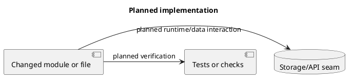

# LocalTrace Issue Workflow

Status: draft for human review.

LocalTrace uses GitHub issues to control every implementation change. This is mandatory because the project is intentionally built with AI assistance and must avoid uncontrolled scope drift.

## Issue Structure

Use one tracking issue per phase:

```text
P0 Spec + Infrastructure Freeze
P1 Core Skeleton
P2 Winprobe
P3 Browser Extension
P4 Web Settings
P5 Skill
P6 Packaging / Autostart
```

Use small implementation issues under each tracking issue.

Example P0 issues:

```text
P0-001 Write LOCALTRACE_SPEC.md
P0-002 Write EVENT_SCHEMA.md
P0-003 Write ARCHITECTURE.md
P0-004 Write WORKFLOW.md
P0-005 Write INFRASTRUCTURE.md
P0-006 Write issue workflow docs
P0-007 Set up MkDocs
P0-008 Set up markdown lint
P0-009 Set up ruff/pytest
P0-010 Set up pre-commit
P0-011 Set up CI lint/test/docs
P0-012 Set up PR agent review workflow
```

P0 documentation issues may be completed before implementation approval. P0 infrastructure implementation issues require explicit human approval.

## Approved P0 Infrastructure Issue

### P0-INFRA-001 Enable LocalTrace Docs And Lint Infrastructure

Goal:

- Enable local docs preview.
- Enable strict docs build.
- Enable Markdown lint.
- Enable pre-commit checks.
- Enable GitHub Actions CI for LocalTrace docs.

Scope:

- Add MkDocs config for `docs/`.
- Add Markdown lint config.
- Add local dev dependency files.
- Add pre-commit config.
- Add GitHub Actions workflow for docs and lint.

Non-goals:

- No LocalTrace runtime code.
- No Python application skeleton.
- No release packaging.
- No PR agent review workflow.
- No Task Master repository files.

Spec links:

- `docs/INFRASTRUCTURE.md`
- `docs/WORKFLOW.md`
- `docs/ISSUES.md`

Acceptance:

- `mkdocs build --strict -f mkdocs.yml` passes.
- `npx markdownlint-cli2 --config .markdownlint-cli2.yaml "docs/**/*.md"` passes.
- `pre-commit run --all-files` passes.
- GitHub Actions workflow runs on push and pull request.

## Tracking Issue Template

```markdown
# Pn Phase Name

## Scope

## Non-Goals

## Dependencies

## Issues

- [ ] Pn-001 ...
- [ ] Pn-002 ...

## Acceptance Checklist

- [ ] ...

## Review Gate

Implementation can start only after explicit human approval.
Phase can close only after human review of results.
```

## Small Issue Template

````markdown
# Pn-XXX Short Title

## Scope

## Non-Goals

## Spec Links

## Acceptance Checklist

- [ ] ...

## Verification

Commands expected:

```bash
...
```

## Implementation Plan

Required for non-trivial implementation issues before coding starts.
Tiny fixes may use a short text plan.



- Expected changed files:
- Acceptance mapping:
- Explicit non-goals:
- Verification flow:

## Review Gate

No implementation until human approval.
````

## Required Fields

Every small issue must have:

- Scope.
- Non-goals.
- Acceptance checklist.
- Spec links.
- Verification plan.
- Implementation plan for non-trivial implementation work.
- Review gate.

## PR Rules

Every PR must:

- Link exactly one small issue unless explicitly approved.
- Include changed files.
- Compare planned implementation against actual changed files and flow.
- Include plan deviation notes when actual flow differs materially.
- Include verification commands and results.
- Include screenshots only if UI changed.
- Include agent review output if configured.
- State whether any generated files changed.

Every PR must not:

- Include unrelated formatting churn.
- Implement future phase work.
- Add auth/token/login.
- Add LAN/cloud behavior.
- Add derived tables without approved spec.
- Modify runtime capture scope without approved spec.

## Commit Rules

Preferred commit style:

```text
docs(localtrace): write p0 spec draft
feat(localtrace-core): add health endpoint
test(localtrace-core): cover event validation
chore(localtrace): add markdown lint
```

Each commit should reference the issue when practical:

```text
Refs #123
Closes #123
```

## Labels

Recommended labels:

```text
phase:p0
phase:p1
phase:p2
phase:p3
phase:p4
phase:p5
phase:p6

type:spec
type:implementation
type:test
type:infra
type:docs
type:review

status:blocked
status:ready-for-review
status:approved
```

## Candidate Latency Issues

These candidates came from a July 7, 2026 latency investigation. They are not
approved implementation scope yet; promote them to GitHub issues before coding.
When promoted, replace `CAND` identifiers with normal issue identifiers and keep
the scope narrow enough for one PR.

Latency vocabulary for these candidates:

- Source freshness: how old the latest `observed_at` value is for one capture
  source.
- Receive lag: the difference between `received_at` and `observed_at` for one
  event.
- UI freshness: how old the Web UI's last successful data refresh is.

Candidate issue rules:

- Candidate issues may include code-path evidence, because they are review
  notes. Promoted GitHub issues should prefer behavior descriptions and stable
  spec links.
- Do not start implementation from a candidate issue. Promote it to a reviewed
  small issue first.
- If two candidates touch the same UI surface, decide ownership before coding so
  one PR does not quietly implement both.

Observed symptom map:

- Refresh feels stuck or blocks other UI controls: see `P4-CAND-001`.
- New app/window focus appears late in Health or Recent flow: first distinguish
  UI freshness from source absence with `P4-CAND-002`, then diagnose the probe
  runtime with `P2-CAND-001`.
- Browser tab, title, or audio activity appears late: first distinguish UI
  freshness from receive lag with `P4-CAND-002`, then handle same-tab title and
  audio activity freshness with `P3-CAND-001`.
- General "data collection delay" should not be treated as one bug until the UI
  shows source freshness, receive lag, and UI freshness separately.

### Latency Optimization Plan

Recommended sequence:

1. Promote `P4-CAND-002` first to establish the Web UI freshness vocabulary and
   visible diagnostics. This makes later changes measurable by showing source
   freshness, receive lag, and UI freshness in one place.
2. Promote `P4-CAND-001` second to make Metrics refresh non-blocking and live.
   This issue owns refresh scheduling, request de-duplication, and local busy
   state. It should reuse the freshness terms introduced by `P4-CAND-002`.
3. Promote `P3-CAND-001` in parallel or immediately after the first P4 issue.
   It is source-side and should not wait for Web UI work unless the same agent
   is already changing shared tests or demo data.
4. Promote `P2-CAND-001` after `P4-CAND-002` for any UI-facing health state.
   Runtime docs and local probe checks may be promoted earlier if they do not
   touch the Web UI.
5. Reassess poll and heartbeat intervals only after the diagnostics can prove a
   running source is still late. Do not lower `poll_ms` or
   `heartbeat_seconds` as the first fix.

Ownership boundaries:

- `P4-CAND-002` owns labels, calculations, and display rules for source
  freshness, receive lag, and UI freshness.
- `P4-CAND-001` owns refresh behavior: auto-refresh cadence, in-flight request
  handling, and which controls remain interactive during refresh.
- `P3-CAND-001` owns browser extension emission rules for same-tab title
  changes and must not change browser permissions or URL capture scope.
- `P2-CAND-001` owns Windows probe runtime detection, operator guidance, and
  packaging/runtime smoke checks.

Success targets:

- A newly received browser or probe event appears in Recent flow within one
  Metrics auto-refresh interval.
- Manual Refresh never disables unrelated controls.
- A same-tab browser title change emits without waiting for the 60-second
  heartbeat.
- A missing Windows probe is visible as a source absence problem, not confused
  with receive lag or UI staleness.
- If future evidence shows the probe is running but late, a later issue may tune
  polling with before/after receive-lag measurements.

Recommended issue promotion:

```text
P4-XXX Surface Source Freshness And Receive Lag
P4-YYY Make Web UI Refresh Non-Blocking And Live
P3-ZZZ Emit Browser Same-Tab Title Changes Immediately
P2/P6-AAA Diagnose Windows Probe Runtime Absence
```

### P4-CAND-001 Make Web UI Refresh Non-Blocking And Live

Scope:

- Make Metrics refresh feel responsive when recent activity is changing.
- Keep navigation and settings controls usable while a background refresh is in
  flight.
- Add a light Metrics auto-refresh loop so Health and Recent flow do not depend
  on manual Refresh.

Non-goals:

- No core API or storage schema changes.
- No capture interval or heartbeat changes.
- No derived tables.
- No report, planner, or review UI.

Spec links:

- `docs/LOCALTRACE_SPEC.md` Web display.
- `docs/LOCALTRACE_SPEC.md` Web UI V1 Scope.
- `docs/LOCALTRACE_SPEC.md` Component Independence.

Evidence:

- The running local API returned `/health`, `/settings`, `/tracking/status`,
  `/privacy/rules`, `/events?limit=500&order=desc`, `/web/app.js`,
  `/web/styles.css`, and `/` in roughly 1.5-3ms.
- `web/app.js` currently fetches all page data in `loadAll()`, renders all
  Metrics sections, and `setBusy(true)` disables every button during refresh.
- `web/app.js` only calls `loadAll()` on page load and manual Refresh; there is
  no auto-refresh loop.

Acceptance checklist:

- [ ] Manual refresh does not disable navigation, segmented filters, pause, or
      settings controls unrelated to the request.
- [ ] Metrics auto-refreshes while visible, with a bounded interval such as
      2-3 seconds.
- [ ] Auto-refresh does not overlap requests or spam the local API when a
      previous refresh is still in flight.
- [ ] Recent flow and Health update without clicking Refresh.
- [ ] Playwright coverage proves the UI remains interactive during refresh and
      receives an automatic update.

Verification:

Expected commands:

```bash
node --check web/app.js
npx playwright test tests/web-ui-pages.spec.mjs
```

Blocked by:

- None - can start immediately.

Review gate:

- Promote to a normal P4 issue and approve before implementation.

### P3-CAND-001 Emit Browser Same-Tab Title Changes Immediately

Scope:

- Treat same-tab title changes as meaningful activity changes for browser
  focus/audio events.
- Avoid waiting for the default 60-second heartbeat when only the title changed.

Non-goals:

- No default heartbeat change.
- No full URL capture.
- No new browser permissions.
- No native messaging.
- No Web UI changes.

Spec links:

- `docs/LOCALTRACE_SPEC.md` Browser extension events.
- `docs/LOCALTRACE_SPEC.md` Privacy defaults.
- `docs/EVENT_SCHEMA.md` `tab_active`.

Evidence:

- `extension/service_worker.js` listens to `chrome.tabs.onUpdated` when
  `changeInfo.title` is present.
- `maybeEmitTabActivity()` only treats domain, tab id, and window id changes as
  changed; title is not part of the activity state.
- `DEFAULT_SETTINGS.heartbeatSeconds` is 60, so same-tab title changes can be
  suppressed until heartbeat.

Acceptance checklist:

- [ ] Same tab/domain/window with a new title emits a fresh `tab_active` event.
- [ ] Same tab/domain/window with an unchanged title still respects heartbeat
      throttling.
- [ ] Focus and background-audio tab activity keep separate freshness state.
- [ ] Extension tests cover title-change emission and no-op unchanged-title
      behavior.

Verification:

Expected commands:

```bash
node --check extension/event_builder.mjs
node --check extension/service_worker.js
node --test extension/*.test.mjs
```

Blocked by:

- None - can start immediately.

Review gate:

- Promote to a normal P3 issue and approve before implementation.

### P4-CAND-002 Surface Source Freshness And Receive Lag

Scope:

- Make capture latency diagnosable in the Web UI.
- Show whether data is missing because a source is absent, posted late, or only
  stale in the UI.

Non-goals:

- No capture behavior changes.
- No poll interval or heartbeat changes.
- No derived tables.
- No Windows packaging changes.

Spec links:

- `docs/LOCALTRACE_SPEC.md` Event Time Semantics.
- `docs/LOCALTRACE_SPEC.md` Health.
- `docs/EVENT_SCHEMA.md` Event envelope.

Evidence:

- The July 7 local `/health` response showed `browser_extension` timestamps, but
  `windows_probe.last_observed_at` and `last_received_at` were both null.
- Recent events had browser `observed_at` and `received_at` values within a few
  hundred milliseconds, so the observed browser path was not posting late.
- The UI currently shows source timestamps as raw Health values and does not
  surface source age or `received_at - observed_at` lag near Recent flow.

Acceptance checklist:

- [ ] Health displays a clear "Windows probe not seen" state when source
      timestamps are null.
- [ ] Health displays age since last observed event for each source.
- [ ] Recent flow displays or exposes receive lag for each row.
- [ ] The UI distinguishes source absence, source stale, receive lag, and UI
      refresh age.
- [ ] Tests cover null-source and late-received-event rendering.

Verification:

Expected commands:

```bash
node --check web/app.js
npx playwright test tests/web-ui-pages.spec.mjs
```

Blocked by:

- None - can start immediately.

Review gate:

- Promote to a normal P4 issue and approve before implementation.

### P2-CAND-001 Diagnose Windows Probe Runtime Absence

Scope:

- Make it obvious when `localtrace-winprobe` is not running or not posting to
  core.
- Prefer diagnostics before changing the Windows polling interval.

Non-goals:

- No poll interval change.
- No Windows Service conversion.
- No browser extension changes.
- No Web UI freshness work beyond what is explicitly delegated from
  P4-CAND-002.

Spec links:

- `docs/LOCALTRACE_SPEC.md` `localtrace-winprobe.exe`.
- `docs/LOCALTRACE_SPEC.md` Health.
- `docs/PACKAGING.md` Windows release smoke flow.

Evidence:

- The July 7 local process list showed `localtrace_core` but no winprobe process.
- The local `/health` response had no `windows_probe` timestamps.
- `localtrace-winprobe` defaults to a 1000ms poll interval, so a running probe
  should normally observe app focus within about one poll cycle.

Acceptance checklist:

- [ ] Web UI Health has an actionable state for missing Windows probe activity.
- [ ] Windows packaging or runtime docs explain how to start and verify
      `localtrace-winprobe`.
- [ ] A local check can distinguish "probe not running" from "probe running but
      failed to post".
- [ ] Poll interval changes are not made unless later evidence shows the probe
      is running and still too slow.

Verification:

Expected commands:

```bash
.venv/bin/python -m pytest tests/test_packaging.py tests/test_winprobe.py -q
npm run lint:md
```

Blocked by:

- P4-CAND-002 for any Web UI health/freshness rendering. Probe runtime docs and
  checks can start immediately.

Review gate:

- Promote to a normal P2 or P6 issue and approve before implementation,
  depending on whether the selected fix is probe behavior or packaging/runtime
  guidance.

## Agent Review In Issues

Agent-generated plans must be posted or summarized in the relevant issue before implementation.

For non-trivial implementation issues, the plan must include a compact PlantUML
diagram. The diagram should show affected modules or files, runtime/API/data
flow, verification flow, expected changed files, acceptance checklist mapping,
and explicit non-goals where useful.

PlantUML plans are review artifacts. They do not expand scope and do not
override the issue, spec, workflow, or human review gates. The agent may update
the plan before coding starts or when issue scope is explicitly revised. After
coding starts, material differences from the plan must be recorded as plan
deviation notes in the issue or PR.

Tiny fixes may use a text-only plan instead of PlantUML. Examples include typo
fixes, wording-only documentation edits, single-line config corrections, issue
or PR metadata updates, and mechanical lint fixes inside an approved scope.

Agent review cannot close issues. Only the human can accept completion.

## Task Master Relationship

Task Master AI is optional. It may generate task candidates, dependency order,
and next-task suggestions when the work has multiple parallel tracks, multiple
agents, unclear sequencing, or a checklist that has become too large for one
issue.

It is not the official project ledger.

Rules:

- Do not use Task Master as a mandatory step for every issue.
- A coherent phase may stay in one GitHub issue.
- Do not create GitHub child issues from Task Master output unless the human
  explicitly asks to split the work.
- A Task Master task becomes actionable only when it is represented by an
  approved GitHub issue.
- The GitHub issue must link the relevant spec sections when implementation
  depends on a spec.
- The GitHub issue must list non-goals when scope control matters.
- The GitHub issue acceptance checklist overrides Task Master text.
- Task Master status may mirror GitHub issue status, not the other way around.

Forbidden:

- Starting implementation from a Task Master task without an approved GitHub
  issue.
- Closing a GitHub issue because Task Master says the task is done.
- Adding Task Master-generated extra scope without human issue review.
- Auto-generating child issues from a phase issue without explicit human
  request.

## Done Definition

An implementation issue is done only when:

- Scope is implemented.
- Non-goals were not implemented.
- Acceptance checklist is complete.
- Non-trivial implementation work had a pre-code PlantUML plan.
- The PR compared planned implementation against the actual diff.
- Plan deviations, if any, were recorded and stayed inside scope.
- Verification commands ran.
- CI is green, once CI exists.
- PR agent review ran, once configured.
- Human explicitly approved.

## Issue Workflow Acceptance Checklist

- [ ] Every implementation change requires an issue.
- [ ] Phase tracking issues are required.
- [ ] Small issues have acceptance checklists.
- [ ] Issues define non-goals.
- [ ] Human approval is required to close implementation issues.
- [ ] Agent review cannot replace human review.
- [ ] A coherent phase may use one GitHub issue.
- [ ] Task Master is optional.
- [ ] Task Master cannot create child issues without explicit human request.
- [ ] GitHub issue status is authoritative.
